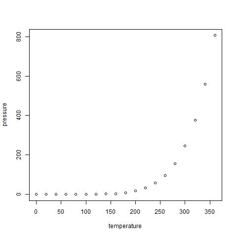

```{r setup, include=FALSE}

knitr::opts_chunk$set(echo = TRUE)
knitr::opts_knit$set(root.dir = "")
getwd()

print(getwd())
knitr::opts_knit$set(root.dir = rprojroot::find_rstudio_root_file())
dwdir = print(getwd())

# setting directories
dweiimd  = paste0(dwdir, "/essay_ii_figures")

# define memory limit
memory.limit(size = 999999999999)

{ 
  # Check if the packages that we need are installed
  want = c("tidyverse", "plm", "texreg", "lmtest", "tibble")
  have = want %in% rownames(installed.packages())
  # Install the packages that we miss
  if ( any(!have) ) { install.packages( want[!have] ) }
  # Load the packages
  junk <- lapply(want, library, character.only = T)
  # Remove the objects we created
  rm(have, want, junk)
} # Import packages

```

## R Markdown

This is an R Markdown document. Markdown is a simple formatting syntax for authoring HTML, PDF, and MS Word documents. For more details on using R Markdown see <http://rmarkdown.rstudio.com>.

When you click the **Knit** button a document will be generated that includes both content as well as the output of any embedded R code chunks within the document. You can embed an R code chunk like this:

```{r cars}
summary(cars)
```

## Including Plots

You can also embed plots, for example:

```{r pressure, echo=FALSE, include=FALSE}

setwd(dweiimd)

jpeg("pressure.jpg") 
# your plot for example    
plot(pressure)
dev.off()

```



Note that the `echo = FALSE` parameter was added to the code chunk to prevent printing of the R code that generated the plot.
