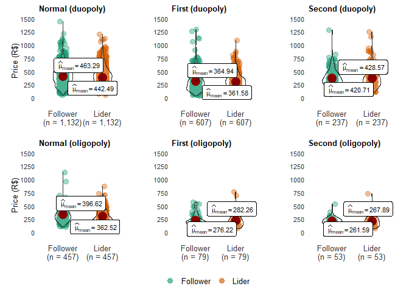

#### I - What is the Brazillian airline market estructure?

<table>
<thead>
<tr>
<th style="text-align:left;">
variable
</th>
<th style="text-align:right;">
normal
</th>
<th style="text-align:right;">
first
</th>
<th style="text-align:right;">
second
</th>
</tr>
</thead>
<tbody>
<tr>
<td style="text-align:left;">
Number of routes
</td>
<td style="text-align:right;">
1145
</td>
<td style="text-align:right;">
885
</td>
<td style="text-align:right;">
718
</td>
</tr>
<tr>
<td style="text-align:left;">
Number of competitors
</td>
<td style="text-align:right;">
8
</td>
<td style="text-align:right;">
5
</td>
<td style="text-align:right;">
5
</td>
</tr>
<tr>
<td style="text-align:left;">
Monthly seats sold average (in millions)
</td>
<td style="text-align:right;">
6
</td>
<td style="text-align:right;">
2
</td>
<td style="text-align:right;">
3
</td>
</tr>
<tr>
<td style="text-align:left;">
Aircraft seats occupation average (in %)
</td>
<td style="text-align:right;">
60
</td>
<td style="text-align:right;">
50
</td>
<td style="text-align:right;">
60
</td>
</tr>
<tr>
<td style="text-align:left;">
Monthly takeoff average (in thousand)
</td>
<td style="text-align:right;">
63
</td>
<td style="text-align:right;">
26
</td>
<td style="text-align:right;">
34
</td>
</tr>
<tr>
<td style="text-align:left;">
Aircraft size (number of seats)
</td>
<td style="text-align:right;">
152
</td>
<td style="text-align:right;">
154
</td>
<td style="text-align:right;">
153
</td>
</tr>
</tbody>
</table>

Main results found:

-   The number of routes and aircraft occupancy rate showed a downward
    trend during the two pandemic periods;

-   Three companies stopped operating during the pandemic;

-   The number of seats sold monthly dropped 61.68% during the first
    Covid19 period and recovered 12.3% in the second moment;

-   The average aircraft size increased in the first Covid19 period and
    decreased again in the second wave, but remained higher than in the
    period before the pandemic.

#### II - How is the Brazilian commercial aviation market competition?

<table>
<thead>
<tr>
<th style="text-align:left;">
variable
</th>
<th style="text-align:left;">
covid\_wave
</th>
<th style="text-align:right;">
single
</th>
<th style="text-align:right;">
var\_1
</th>
<th style="text-align:right;">
duopoly
</th>
<th style="text-align:right;">
var\_2
</th>
<th style="text-align:right;">
oligopoly
</th>
<th style="text-align:right;">
var\_3
</th>
<th style="text-align:right;">
total
</th>
<th style="text-align:right;">
var\_4
</th>
</tr>
</thead>
<tbody>
<tr>
<td style="text-align:left;">
Number of routes
</td>
<td style="text-align:left;">
normal
</td>
<td style="text-align:right;">
957.0
</td>
<td style="text-align:right;">
0.0
</td>
<td style="text-align:right;">
386.0
</td>
<td style="text-align:right;">
0.0
</td>
<td style="text-align:right;">
194.0
</td>
<td style="text-align:right;">
0.0
</td>
<td style="text-align:right;">
1537
</td>
<td style="text-align:right;">
0.0
</td>
</tr>
<tr>
<td style="text-align:left;">
Number of routes
</td>
<td style="text-align:left;">
first
</td>
<td style="text-align:right;">
826.0
</td>
<td style="text-align:right;">
-13.7
</td>
<td style="text-align:right;">
308.0
</td>
<td style="text-align:right;">
-20.2
</td>
<td style="text-align:right;">
109.0
</td>
<td style="text-align:right;">
-43.8
</td>
<td style="text-align:right;">
1243
</td>
<td style="text-align:right;">
-19.1
</td>
</tr>
<tr>
<td style="text-align:left;">
Number of routes
</td>
<td style="text-align:left;">
second
</td>
<td style="text-align:right;">
591.0
</td>
<td style="text-align:right;">
-28.4
</td>
<td style="text-align:right;">
226.0
</td>
<td style="text-align:right;">
-26.6
</td>
<td style="text-align:right;">
59.0
</td>
<td style="text-align:right;">
-45.9
</td>
<td style="text-align:right;">
876
</td>
<td style="text-align:right;">
-29.5
</td>
</tr>
<tr>
<td style="text-align:left;">
Average prices
</td>
<td style="text-align:left;">
normal
</td>
<td style="text-align:right;">
428.0
</td>
<td style="text-align:right;">
0.0
</td>
<td style="text-align:right;">
392.0
</td>
<td style="text-align:right;">
0.0
</td>
<td style="text-align:right;">
328.0
</td>
<td style="text-align:right;">
0.0
</td>
<td style="text-align:right;">
369
</td>
<td style="text-align:right;">
0.0
</td>
</tr>
<tr>
<td style="text-align:left;">
Average prices
</td>
<td style="text-align:left;">
first
</td>
<td style="text-align:right;">
377.0
</td>
<td style="text-align:right;">
-11.9
</td>
<td style="text-align:right;">
338.0
</td>
<td style="text-align:right;">
-13.8
</td>
<td style="text-align:right;">
270.0
</td>
<td style="text-align:right;">
-17.7
</td>
<td style="text-align:right;">
330
</td>
<td style="text-align:right;">
-10.6
</td>
</tr>
<tr>
<td style="text-align:left;">
Average prices
</td>
<td style="text-align:left;">
second
</td>
<td style="text-align:right;">
461.0
</td>
<td style="text-align:right;">
22.3
</td>
<td style="text-align:right;">
397.0
</td>
<td style="text-align:right;">
17.5
</td>
<td style="text-align:right;">
333.0
</td>
<td style="text-align:right;">
23.3
</td>
<td style="text-align:right;">
394
</td>
<td style="text-align:right;">
19.4
</td>
</tr>
<tr>
<td style="text-align:left;">
seats sold (share %)
</td>
<td style="text-align:left;">
normal
</td>
<td style="text-align:right;">
16.8
</td>
<td style="text-align:right;">
0.0
</td>
<td style="text-align:right;">
34.7
</td>
<td style="text-align:right;">
0.0
</td>
<td style="text-align:right;">
48.5
</td>
<td style="text-align:right;">
0.0
</td>
<td style="text-align:right;">
100
</td>
<td style="text-align:right;">
0.0
</td>
</tr>
<tr>
<td style="text-align:left;">
seats sold (share %)
</td>
<td style="text-align:left;">
first
</td>
<td style="text-align:right;">
25.6
</td>
<td style="text-align:right;">
8.8
</td>
<td style="text-align:right;">
50.1
</td>
<td style="text-align:right;">
15.4
</td>
<td style="text-align:right;">
24.2
</td>
<td style="text-align:right;">
-24.3
</td>
<td style="text-align:right;">
100
</td>
<td style="text-align:right;">
0.0
</td>
</tr>
<tr>
<td style="text-align:left;">
seats sold (share %)
</td>
<td style="text-align:left;">
second
</td>
<td style="text-align:right;">
28.2
</td>
<td style="text-align:right;">
2.5
</td>
<td style="text-align:right;">
44.6
</td>
<td style="text-align:right;">
-5.5
</td>
<td style="text-align:right;">
27.2
</td>
<td style="text-align:right;">
3.0
</td>
<td style="text-align:right;">
100
</td>
<td style="text-align:right;">
0.0
</td>
</tr>
<tr>
<td style="text-align:left;">
Takeoffs (share %)
</td>
<td style="text-align:left;">
normal
</td>
<td style="text-align:right;">
26.7
</td>
<td style="text-align:right;">
0.0
</td>
<td style="text-align:right;">
31.5
</td>
<td style="text-align:right;">
0.0
</td>
<td style="text-align:right;">
41.8
</td>
<td style="text-align:right;">
0.0
</td>
<td style="text-align:right;">
100
</td>
<td style="text-align:right;">
0.0
</td>
</tr>
<tr>
<td style="text-align:left;">
Takeoffs (share %)
</td>
<td style="text-align:left;">
first
</td>
<td style="text-align:right;">
34.4
</td>
<td style="text-align:right;">
7.7
</td>
<td style="text-align:right;">
43.5
</td>
<td style="text-align:right;">
12.0
</td>
<td style="text-align:right;">
22.1
</td>
<td style="text-align:right;">
-19.8
</td>
<td style="text-align:right;">
100
</td>
<td style="text-align:right;">
0.0
</td>
</tr>
<tr>
<td style="text-align:left;">
Takeoffs (share %)
</td>
<td style="text-align:left;">
second
</td>
<td style="text-align:right;">
38.7
</td>
<td style="text-align:right;">
4.3
</td>
<td style="text-align:right;">
38.6
</td>
<td style="text-align:right;">
-5.0
</td>
<td style="text-align:right;">
22.7
</td>
<td style="text-align:right;">
0.6
</td>
<td style="text-align:right;">
100
</td>
<td style="text-align:right;">
0.0
</td>
</tr>
<tr>
<td style="text-align:left;">
Average distance
</td>
<td style="text-align:left;">
normal
</td>
<td style="text-align:right;">
906.0
</td>
<td style="text-align:right;">
0.0
</td>
<td style="text-align:right;">
1146.0
</td>
<td style="text-align:right;">
0.0
</td>
<td style="text-align:right;">
986.0
</td>
<td style="text-align:right;">
0.0
</td>
<td style="text-align:right;">
1003
</td>
<td style="text-align:right;">
0.0
</td>
</tr>
<tr>
<td style="text-align:left;">
Average distance
</td>
<td style="text-align:left;">
first
</td>
<td style="text-align:right;">
1020.0
</td>
<td style="text-align:right;">
12.6
</td>
<td style="text-align:right;">
1227.0
</td>
<td style="text-align:right;">
7.1
</td>
<td style="text-align:right;">
919.0
</td>
<td style="text-align:right;">
-6.8
</td>
<td style="text-align:right;">
1093
</td>
<td style="text-align:right;">
9.0
</td>
</tr>
<tr>
<td style="text-align:left;">
Average distance
</td>
<td style="text-align:left;">
second
</td>
<td style="text-align:right;">
1062.0
</td>
<td style="text-align:right;">
4.1
</td>
<td style="text-align:right;">
1184.0
</td>
<td style="text-align:right;">
-3.5
</td>
<td style="text-align:right;">
937.0
</td>
<td style="text-align:right;">
2.0
</td>
<td style="text-align:right;">
1090
</td>
<td style="text-align:right;">
-0.3
</td>
</tr>
</tbody>
</table>

Main results found:

-   The number of routes served by Brazilian commercial aviation
    decreased during the pandemic period, mainly in oligopolistic
    markets;

-   Fares fell in Covid19's first phase, but returned to a level higher
    than pre-pandemic in the second phase;

-   In the first stage of Covid19, the number of companies operating on
    the same route decreased causing the oligopolized routes to become
    duopoly or monopoly, in the second stage the monopolies continued to
    grow while part of the duopolies became oligopolies;

-   During the pandemic, routes with only one company operating had an
    increase in average distance, while oligopolist routes has the
    opposite effect.

#### III - How did Brazilian commercial aviation behave regionally in the pandemic?

<table>
<thead>
<tr>
<th style="text-align:left;">
covid\_wave
</th>
<th style="text-align:left;">
variable
</th>
<th style="text-align:right;">
a\_MW
</th>
<th style="text-align:right;">
a\_N
</th>
<th style="text-align:right;">
a\_NE
</th>
<th style="text-align:right;">
a\_S
</th>
<th style="text-align:right;">
a\_SE
</th>
<th style="text-align:right;">
d\_MW
</th>
<th style="text-align:right;">
d\_N
</th>
<th style="text-align:right;">
d\_NE
</th>
<th style="text-align:right;">
d\_S
</th>
<th style="text-align:right;">
d\_SE
</th>
</tr>
</thead>
<tbody>
<tr>
<td style="text-align:left;">
normal
</td>
<td style="text-align:left;">
routes
</td>
<td style="text-align:right;">
13.80
</td>
<td style="text-align:right;">
11.79
</td>
<td style="text-align:right;">
20.70
</td>
<td style="text-align:right;">
13.36
</td>
<td style="text-align:right;">
40.35
</td>
<td style="text-align:right;">
13.89
</td>
<td style="text-align:right;">
13.01
</td>
<td style="text-align:right;">
22.18
</td>
<td style="text-align:right;">
14.50
</td>
<td style="text-align:right;">
36.42
</td>
</tr>
<tr>
<td style="text-align:left;">
first
</td>
<td style="text-align:left;">
routes
</td>
<td style="text-align:right;">
14.24
</td>
<td style="text-align:right;">
9.72
</td>
<td style="text-align:right;">
23.50
</td>
<td style="text-align:right;">
12.66
</td>
<td style="text-align:right;">
39.89
</td>
<td style="text-align:right;">
14.12
</td>
<td style="text-align:right;">
11.07
</td>
<td style="text-align:right;">
24.97
</td>
<td style="text-align:right;">
13.56
</td>
<td style="text-align:right;">
36.27
</td>
</tr>
<tr>
<td style="text-align:left;">
second
</td>
<td style="text-align:left;">
routes
</td>
<td style="text-align:right;">
11.84
</td>
<td style="text-align:right;">
11.00
</td>
<td style="text-align:right;">
25.35
</td>
<td style="text-align:right;">
12.81
</td>
<td style="text-align:right;">
39.00
</td>
<td style="text-align:right;">
11.98
</td>
<td style="text-align:right;">
11.00
</td>
<td style="text-align:right;">
25.21
</td>
<td style="text-align:right;">
13.51
</td>
<td style="text-align:right;">
38.30
</td>
</tr>
<tr>
<td style="text-align:left;">
normal
</td>
<td style="text-align:left;">
seats
</td>
<td style="text-align:right;">
10.84
</td>
<td style="text-align:right;">
5.97
</td>
<td style="text-align:right;">
21.15
</td>
<td style="text-align:right;">
16.03
</td>
<td style="text-align:right;">
46.01
</td>
<td style="text-align:right;">
13.34
</td>
<td style="text-align:right;">
4.12
</td>
<td style="text-align:right;">
16.50
</td>
<td style="text-align:right;">
10.72
</td>
<td style="text-align:right;">
55.32
</td>
</tr>
<tr>
<td style="text-align:left;">
first
</td>
<td style="text-align:left;">
seats
</td>
<td style="text-align:right;">
11.62
</td>
<td style="text-align:right;">
7.62
</td>
<td style="text-align:right;">
24.39
</td>
<td style="text-align:right;">
14.93
</td>
<td style="text-align:right;">
41.43
</td>
<td style="text-align:right;">
12.88
</td>
<td style="text-align:right;">
4.70
</td>
<td style="text-align:right;">
18.51
</td>
<td style="text-align:right;">
7.42
</td>
<td style="text-align:right;">
56.50
</td>
</tr>
<tr>
<td style="text-align:left;">
second
</td>
<td style="text-align:left;">
seats
</td>
<td style="text-align:right;">
11.15
</td>
<td style="text-align:right;">
7.83
</td>
<td style="text-align:right;">
26.12
</td>
<td style="text-align:right;">
14.17
</td>
<td style="text-align:right;">
40.74
</td>
<td style="text-align:right;">
12.22
</td>
<td style="text-align:right;">
4.92
</td>
<td style="text-align:right;">
20.17
</td>
<td style="text-align:right;">
6.70
</td>
<td style="text-align:right;">
55.99
</td>
</tr>
</tbody>
</table>

Main results found:

-   During a pandemic, airports in the North and Northeast regions
    increased their market share in terms of both the number of routes
    and the volume of tickets sold;

-   The Southeast region had an increase in share in departure routes
    while the South region was the most affected, lost share both in
    departure and arrival points.

#### V - Did the pandemic change passenger boarding times at Brazilian airports?

<table>
<thead>
<tr>
<th style="text-align:left;">
covid\_wave
</th>
<th style="text-align:right;">
0-5
</th>
<th style="text-align:right;">
12-17
</th>
<th style="text-align:right;">
18-23
</th>
<th style="text-align:right;">
6-11
</th>
</tr>
</thead>
<tbody>
<tr>
<td style="text-align:left;">
normal
</td>
<td style="text-align:right;">
11.89
</td>
<td style="text-align:right;">
36.21
</td>
<td style="text-align:right;">
23.04
</td>
<td style="text-align:right;">
28.86
</td>
</tr>
<tr>
<td style="text-align:left;">
first
</td>
<td style="text-align:right;">
9.24
</td>
<td style="text-align:right;">
38.00
</td>
<td style="text-align:right;">
21.42
</td>
<td style="text-align:right;">
31.34
</td>
</tr>
<tr>
<td style="text-align:left;">
second
</td>
<td style="text-align:right;">
10.68
</td>
<td style="text-align:right;">
37.57
</td>
<td style="text-align:right;">
21.27
</td>
<td style="text-align:right;">
30.48
</td>
</tr>
</tbody>
</table>

Main results found:

-   There was little change in boarding schedules. In general,
    passengers preferred to travel during the day (6:00 am to 5:00 pm)
    overnight hours (6:00 am to 5:00 am).

#### VI - What was the behavior of prices, average aircraft size, seat sales and take-offs of the top 3 airlines during the previous period and during the COVID19 pandemic?

<table>
<thead>
<tr>
<th style="text-align:left;">
covid\_wave
</th>
<th style="text-align:left;">
variable
</th>
<th style="text-align:right;">
AZU-a.sin
</th>
<th style="text-align:right;">
AZU-b.duo
</th>
<th style="text-align:right;">
AZU-c.oli
</th>
<th style="text-align:right;">
AZU-d.tot
</th>
<th style="text-align:right;">
GLO-a.sin
</th>
<th style="text-align:right;">
GLO-b.duo
</th>
<th style="text-align:right;">
GLO-c.oli
</th>
<th style="text-align:right;">
GLO-d.tot
</th>
<th style="text-align:right;">
OUT-a.sin
</th>
<th style="text-align:right;">
OUT-b.duo
</th>
<th style="text-align:right;">
OUT-c.oli
</th>
<th style="text-align:right;">
OUT-d.tot
</th>
<th style="text-align:right;">
TAM-a.sin
</th>
<th style="text-align:right;">
TAM-b.duo
</th>
<th style="text-align:right;">
TAM-c.oli
</th>
<th style="text-align:right;">
TAM-d.tot
</th>
</tr>
</thead>
<tbody>
<tr>
<td style="text-align:left;">
normal
</td>
<td style="text-align:left;">
aircraft
</td>
<td style="text-align:right;">
105.31
</td>
<td style="text-align:right;">
120.43
</td>
<td style="text-align:right;">
131.70
</td>
<td style="text-align:right;">
115.20
</td>
<td style="text-align:right;">
171.10
</td>
<td style="text-align:right;">
176.68
</td>
<td style="text-align:right;">
174.86
</td>
<td style="text-align:right;">
175.20
</td>
<td style="text-align:right;">
68.57
</td>
<td style="text-align:right;">
115.96
</td>
<td style="text-align:right;">
152.76
</td>
<td style="text-align:right;">
121.97
</td>
<td style="text-align:right;">
166.89
</td>
<td style="text-align:right;">
176.58
</td>
<td style="text-align:right;">
180.44
</td>
<td style="text-align:right;">
177.81
</td>
</tr>
<tr>
<td style="text-align:left;">
first
</td>
<td style="text-align:left;">
aircraft
</td>
<td style="text-align:right;">
124.26
</td>
<td style="text-align:right;">
145.53
</td>
<td style="text-align:right;">
133.88
</td>
<td style="text-align:right;">
129.76
</td>
<td style="text-align:right;">
170.01
</td>
<td style="text-align:right;">
175.29
</td>
<td style="text-align:right;">
171.10
</td>
<td style="text-align:right;">
173.44
</td>
<td style="text-align:right;">
60.66
</td>
<td style="text-align:right;">
67.27
</td>
<td style="text-align:right;">
69.11
</td>
<td style="text-align:right;">
62.14
</td>
<td style="text-align:right;">
164.13
</td>
<td style="text-align:right;">
174.46
</td>
<td style="text-align:right;">
170.66
</td>
<td style="text-align:right;">
172.53
</td>
</tr>
<tr>
<td style="text-align:left;">
second
</td>
<td style="text-align:left;">
aircraft
</td>
<td style="text-align:right;">
125.16
</td>
<td style="text-align:right;">
139.35
</td>
<td style="text-align:right;">
141.03
</td>
<td style="text-align:right;">
129.95
</td>
<td style="text-align:right;">
176.46
</td>
<td style="text-align:right;">
179.25
</td>
<td style="text-align:right;">
174.77
</td>
<td style="text-align:right;">
177.58
</td>
<td style="text-align:right;">
69.40
</td>
<td style="text-align:right;">
76.83
</td>
<td style="text-align:right;">
162.00
</td>
<td style="text-align:right;">
85.03
</td>
<td style="text-align:right;">
167.24
</td>
<td style="text-align:right;">
178.51
</td>
<td style="text-align:right;">
168.81
</td>
<td style="text-align:right;">
174.40
</td>
</tr>
<tr>
<td style="text-align:left;">
normal
</td>
<td style="text-align:left;">
demand
</td>
<td style="text-align:right;">
40.76
</td>
<td style="text-align:right;">
21.40
</td>
<td style="text-align:right;">
37.84
</td>
<td style="text-align:right;">
100.00
</td>
<td style="text-align:right;">
13.78
</td>
<td style="text-align:right;">
43.13
</td>
<td style="text-align:right;">
43.10
</td>
<td style="text-align:right;">
100.00
</td>
<td style="text-align:right;">
20.33
</td>
<td style="text-align:right;">
25.10
</td>
<td style="text-align:right;">
54.57
</td>
<td style="text-align:right;">
100.00
</td>
<td style="text-align:right;">
8.97
</td>
<td style="text-align:right;">
36.90
</td>
<td style="text-align:right;">
54.13
</td>
<td style="text-align:right;">
100.00
</td>
</tr>
<tr>
<td style="text-align:left;">
first
</td>
<td style="text-align:left;">
demand
</td>
<td style="text-align:right;">
45.16
</td>
<td style="text-align:right;">
27.43
</td>
<td style="text-align:right;">
27.40
</td>
<td style="text-align:right;">
100.00
</td>
<td style="text-align:right;">
20.78
</td>
<td style="text-align:right;">
59.81
</td>
<td style="text-align:right;">
19.41
</td>
<td style="text-align:right;">
100.00
</td>
<td style="text-align:right;">
75.30
</td>
<td style="text-align:right;">
11.16
</td>
<td style="text-align:right;">
13.53
</td>
<td style="text-align:right;">
100.00
</td>
<td style="text-align:right;">
8.28
</td>
<td style="text-align:right;">
61.68
</td>
<td style="text-align:right;">
30.04
</td>
<td style="text-align:right;">
100.00
</td>
</tr>
<tr>
<td style="text-align:left;">
second
</td>
<td style="text-align:left;">
demand
</td>
<td style="text-align:right;">
50.59
</td>
<td style="text-align:right;">
21.20
</td>
<td style="text-align:right;">
28.21
</td>
<td style="text-align:right;">
100.00
</td>
<td style="text-align:right;">
19.91
</td>
<td style="text-align:right;">
54.04
</td>
<td style="text-align:right;">
26.05
</td>
<td style="text-align:right;">
100.00
</td>
<td style="text-align:right;">
23.72
</td>
<td style="text-align:right;">
13.00
</td>
<td style="text-align:right;">
63.28
</td>
<td style="text-align:right;">
100.00
</td>
<td style="text-align:right;">
10.09
</td>
<td style="text-align:right;">
57.63
</td>
<td style="text-align:right;">
32.28
</td>
<td style="text-align:right;">
100.00
</td>
</tr>
<tr>
<td style="text-align:left;">
normal
</td>
<td style="text-align:left;">
price
</td>
<td style="text-align:right;">
473.94
</td>
<td style="text-align:right;">
419.63
</td>
<td style="text-align:right;">
358.95
</td>
<td style="text-align:right;">
418.81
</td>
<td style="text-align:right;">
385.06
</td>
<td style="text-align:right;">
377.81
</td>
<td style="text-align:right;">
309.67
</td>
<td style="text-align:right;">
349.44
</td>
<td style="text-align:right;">
431.11
</td>
<td style="text-align:right;">
390.69
</td>
<td style="text-align:right;">
446.04
</td>
<td style="text-align:right;">
429.11
</td>
<td style="text-align:right;">
369.24
</td>
<td style="text-align:right;">
399.52
</td>
<td style="text-align:right;">
316.21
</td>
<td style="text-align:right;">
351.71
</td>
</tr>
<tr>
<td style="text-align:left;">
first
</td>
<td style="text-align:left;">
price
</td>
<td style="text-align:right;">
434.43
</td>
<td style="text-align:right;">
360.18
</td>
<td style="text-align:right;">
307.34
</td>
<td style="text-align:right;">
379.23
</td>
<td style="text-align:right;">
326.89
</td>
<td style="text-align:right;">
324.77
</td>
<td style="text-align:right;">
257.18
</td>
<td style="text-align:right;">
312.09
</td>
<td style="text-align:right;">
334.00
</td>
<td style="text-align:right;">
324.96
</td>
<td style="text-align:right;">
375.70
</td>
<td style="text-align:right;">
338.64
</td>
<td style="text-align:right;">
312.07
</td>
<td style="text-align:right;">
347.73
</td>
<td style="text-align:right;">
255.39
</td>
<td style="text-align:right;">
317.04
</td>
</tr>
<tr>
<td style="text-align:left;">
second
</td>
<td style="text-align:left;">
price
</td>
<td style="text-align:right;">
526.61
</td>
<td style="text-align:right;">
411.31
</td>
<td style="text-align:right;">
396.18
</td>
<td style="text-align:right;">
465.37
</td>
<td style="text-align:right;">
378.35
</td>
<td style="text-align:right;">
380.81
</td>
<td style="text-align:right;">
312.50
</td>
<td style="text-align:right;">
362.53
</td>
<td style="text-align:right;">
395.82
</td>
<td style="text-align:right;">
343.18
</td>
<td style="text-align:right;">
292.06
</td>
<td style="text-align:right;">
323.32
</td>
<td style="text-align:right;">
355.95
</td>
<td style="text-align:right;">
405.73
</td>
<td style="text-align:right;">
307.10
</td>
<td style="text-align:right;">
368.87
</td>
</tr>
<tr>
<td style="text-align:left;">
normal
</td>
<td style="text-align:left;">
take\_off
</td>
<td style="text-align:right;">
54.64
</td>
<td style="text-align:right;">
18.43
</td>
<td style="text-align:right;">
26.92
</td>
<td style="text-align:right;">
100.00
</td>
<td style="text-align:right;">
11.75
</td>
<td style="text-align:right;">
42.58
</td>
<td style="text-align:right;">
45.67
</td>
<td style="text-align:right;">
100.00
</td>
<td style="text-align:right;">
26.85
</td>
<td style="text-align:right;">
22.23
</td>
<td style="text-align:right;">
50.92
</td>
<td style="text-align:right;">
100.00
</td>
<td style="text-align:right;">
8.67
</td>
<td style="text-align:right;">
37.55
</td>
<td style="text-align:right;">
53.78
</td>
<td style="text-align:right;">
100.00
</td>
</tr>
<tr>
<td style="text-align:left;">
first
</td>
<td style="text-align:left;">
take\_off
</td>
<td style="text-align:right;">
65.23
</td>
<td style="text-align:right;">
18.47
</td>
<td style="text-align:right;">
16.31
</td>
<td style="text-align:right;">
100.00
</td>
<td style="text-align:right;">
16.79
</td>
<td style="text-align:right;">
60.25
</td>
<td style="text-align:right;">
22.96
</td>
<td style="text-align:right;">
100.00
</td>
<td style="text-align:right;">
80.08
</td>
<td style="text-align:right;">
11.38
</td>
<td style="text-align:right;">
8.55
</td>
<td style="text-align:right;">
100.00
</td>
<td style="text-align:right;">
7.70
</td>
<td style="text-align:right;">
62.44
</td>
<td style="text-align:right;">
29.85
</td>
<td style="text-align:right;">
100.00
</td>
</tr>
<tr>
<td style="text-align:left;">
second
</td>
<td style="text-align:left;">
take\_off
</td>
<td style="text-align:right;">
67.99
</td>
<td style="text-align:right;">
17.22
</td>
<td style="text-align:right;">
14.79
</td>
<td style="text-align:right;">
100.00
</td>
<td style="text-align:right;">
14.46
</td>
<td style="text-align:right;">
57.42
</td>
<td style="text-align:right;">
28.12
</td>
<td style="text-align:right;">
100.00
</td>
<td style="text-align:right;">
53.82
</td>
<td style="text-align:right;">
31.86
</td>
<td style="text-align:right;">
14.32
</td>
<td style="text-align:right;">
100.00
</td>
<td style="text-align:right;">
9.06
</td>
<td style="text-align:right;">
59.12
</td>
<td style="text-align:right;">
31.83
</td>
<td style="text-align:right;">
100.00
</td>
</tr>
</tbody>
</table>

Main results found:

-   There was an increase in the average size of the aircraft used;

-   The number of competitors per route has decreased. Airlines probably
    concentrated their flights on more profitable routes;

-   Prices decreased in the first the pandemic period, but return to
    increase in the second phase, remaining at a level above that seen
    before the pandemic;

-   During the second phase of the pandemic, Azul intensified its
    takeoffs to routes that it was operating as a monopolist, while TAM
    and Gol returned to operating oligopolistic routes.

#### Comparison of prices charged by Gol on routes that it operates as a market leader, in different market structures and periods

